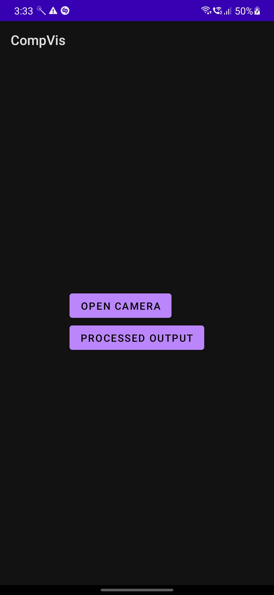
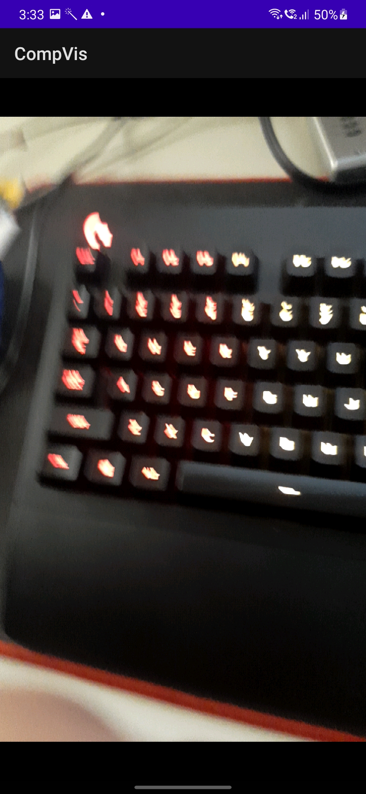
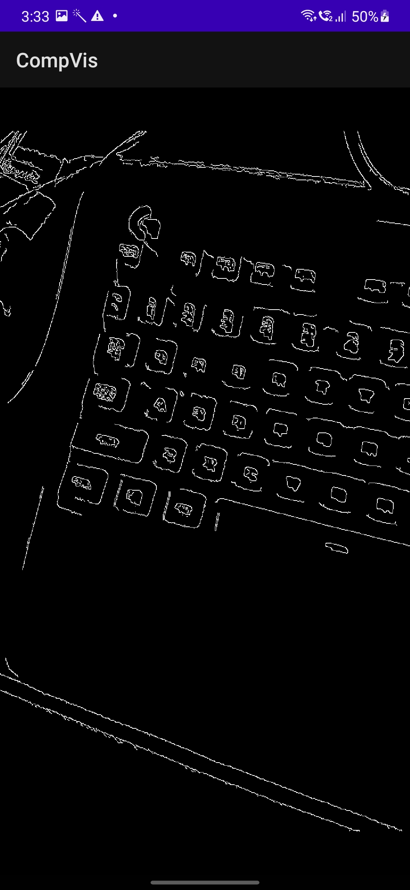

# Edge-Detection 

This is an android app that was developed in Java using Opencv. There are two options when you open the app,
1. Open Camera- This shows us the regular camera view
2. Show Processed output - This shows us the real-time image after Canny edge detection.

### The main page  
 

### The Raw image  
 

### The Processed image  
 
